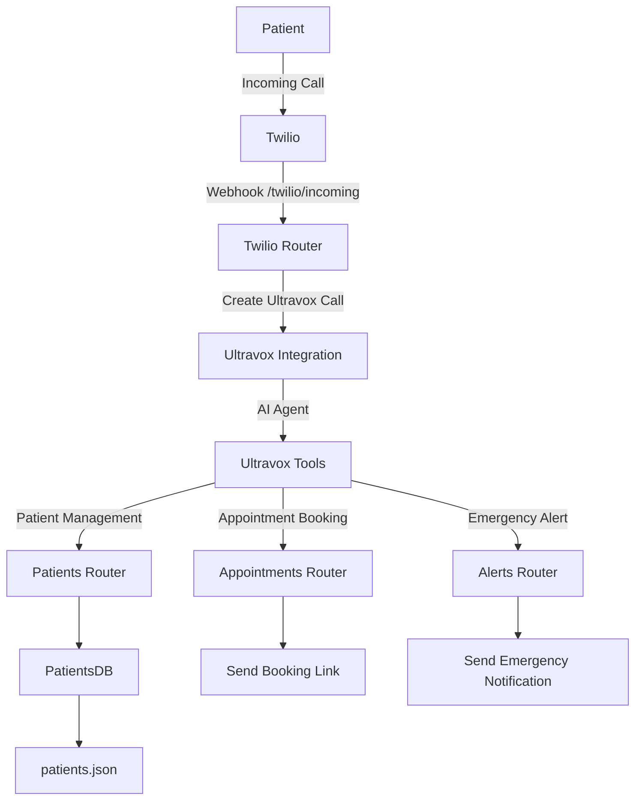
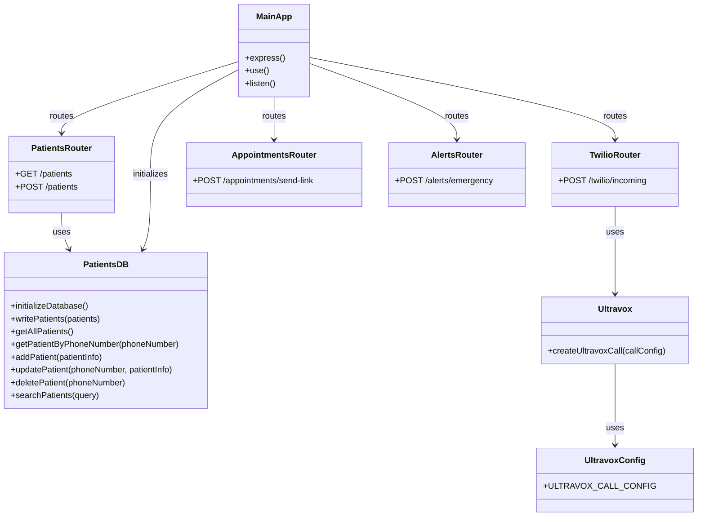

# Dental Clinic AI Receptionist

An AI-powered receptionist for a dental clinic, leveraging **Ultravox.ai** and **Twilio** to handle patient interactions, appointment bookings, and emergency notifications. This project automates routine tasks, enabling the clinic staff to focus on providing excellent care.

## Features

- **Patient Management**: Add, update, delete, and search patient records.
- **Appointment Booking**: Send booking links via email or SMS for existing patients.
- **Emergency Handling**: Notify staff of dental emergencies.
- **Twilio Integration**: Handle incoming calls and connect them to the AI receptionist.
- **Ultravox.ai Integration**: Use AI to provide natural and professional responses.

## Prerequisites

- **Node.js**: Ensure you have Node.js (>= 20.0.0) installed.
- **Environment Variables**: Create a `.env` file with the following keys:
    - `ULTRAVOX_API_KEY`
    - `TWILIO_ACCOUNT_SID`
    - `TWILIO_AUTH_TOKEN`
    - `TOOLS_BASE_URL`

## Getting started

Follow these steps to set up and run the project:

### 1. Clone the repository

```bash
git clone <repository-url>
cd dental-clinic-ai-receptionist
```

### 2. Install dependencies

```bash
npm install
```

### 3. Expose the server using ngrok

To expose your local server to the internet, use `ngrok`. Install `ngrok` if you haven't already, and run the following command:

```bash
ngrok http 3000
```

This will generate a public URL (e.g., `https://<random-subdomain>.ngrok-free.app`) that you can use to test webhooks or share access to your server.

Make sure to update the `TOOLS_BASE_URL` in your `.env` file with the generated ngrok URL.

### 4. Start the server

To start the server in production mode:

```bash
npm run start
```

To start the server in development mode with live reload:

```bash
npm run dev
```

The server will run on `http://localhost:3000`.

### 5. Run tests

To execute the test suite:

```bash
npm run test
```

### 6. Lint and format code

To lint the codebase:

```bash
npm run lint
```

To format the code:

```bash
npm run format
```

## Project structure

- **`src/index.js`**: Entry point of the application.
- **`src/routes/`**: Contains route handlers for patients, appointments, alerts, and Twilio.
- **`src/utils/`**: Utility functions for logging, date-time handling, and API responses.
- **`src/database/`**: Manages patient data storage and retrieval.
- **`src/lib/`**: Contains integrations with external services like Ultravox.ai.

### Flow Diagram

Below is the flow diagram representing the flow of the project:



### UML Diagram

Below is the UML diagram representing the structure of the project:



## License

This project is licensed under the [Apache License 2.0](LICENSE).
